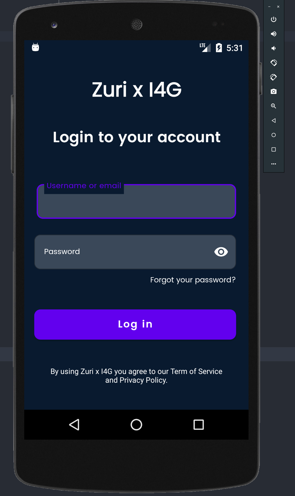
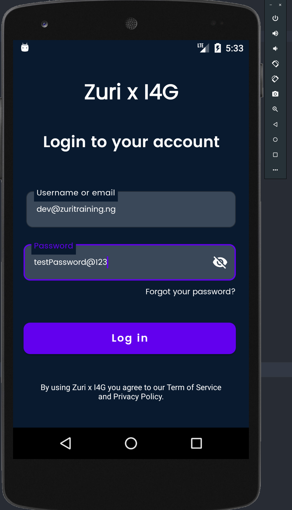
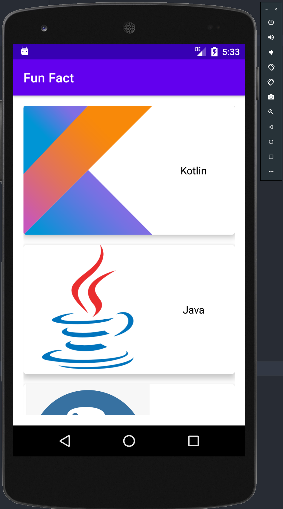
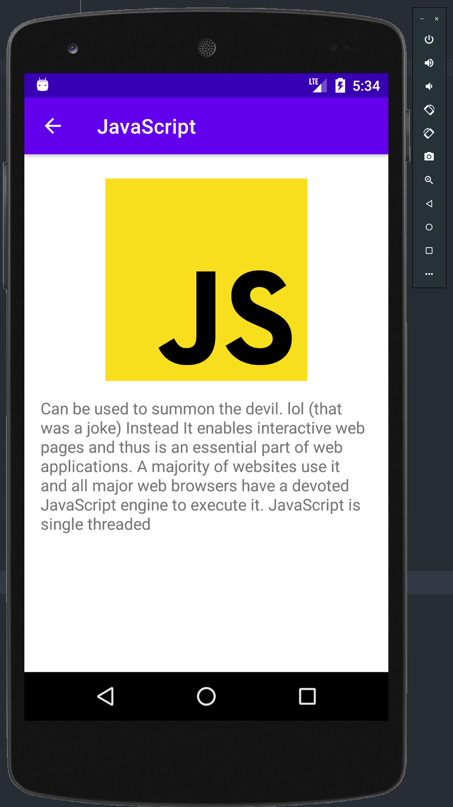

# Zuri Login
 Task Title: More on Views and ViewGroups

## Instruction:
 This task/assignment will be a summary or life case usage of the concepts and things we learnt this week.

 Follow the ListView Tutorials and write the codes in the tutorial.
 Create a new Activity called "LoginActivity".
 Design a login page in the activity_login.xml file (be creative and be sure to use material design components).
 Connect the LoginActivity to the ListView in the LoginActivity.kt file using intents (so when a user clicks the login/sign in button the screen goes to the ListView screen).
 Run the app to make sure it works in an emulator or actual device.

 
 

## Login Details
 \```
    LOGIN_EMAIL = "dev@zuritraining.ng"
    LOGIN_PASSWORD = "testPassword@123"
　\```

 ## Link To APK
 * [Download APK](https://github.com/chydee/Hello-Zuri/releases/tag/v1.0)